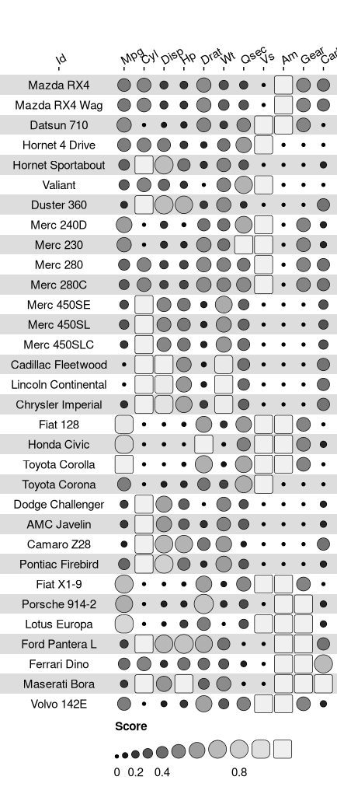

<!-- README.md is generated from README.Rmd. Please edit that file -->

# funkyheatmap: Generating Funky Heatmaps for Data Frames

<!-- badges: start -->

[](https://github.com/rcannood/funkyheatmap/actions/workflows/R-CMD-check.yaml)
<!-- badges: end -->

Allows generating beautiful visualisations for benchmark data frames.
Funky heatmaps can be fine-tuned by providing annotations of the columns
and rows, which allows assigning multiple palettes or geometries or
grouping rows and columns together in categories.

## Installation

You can install the development version of funkyheatmap like so:

``` r
devtools::install_github("rcannood/funkyheatmap")
```

## Example

This is a basic example which shows you how to solve a common problem:

``` r
library(funkyheatmap)
library(tibble)
library(purrr)

data("mtcars")

data <- mtcars %>% rownames_to_column("id")

g <- funky_heatmap(data)
#> ℹ No column info was provided, assuming all columns in `data` are to be plotted.
#> ℹ Column info did not contain column `name`, using `id` to generate it.
#> ℹ Column info did not contain information on which columns to plot, inferring from `data` types.
#> ℹ Column info did not contain group information, assuming columns are ungrouped.
#> ℹ Column info did not contain a column called 'palette', generating palettes based on the 'geom' column.
#> ℹ Column info did not contain a column called 'options', generating ptions based on the 'geom' column.
#> ℹ No row info was provided, assuming all rows in `data` are to be plotted.
#> ℹ Row info did not contain group information, assuming rows are ungrouped.
#> ℹ No palettes were provided, trying to automatically assign palettes.
#> ℹ Palette named 'numerical_palette' was not defined. Assuming palette is numerical. Automatically selected palette 'Greys'.
```

``` r
g
```


