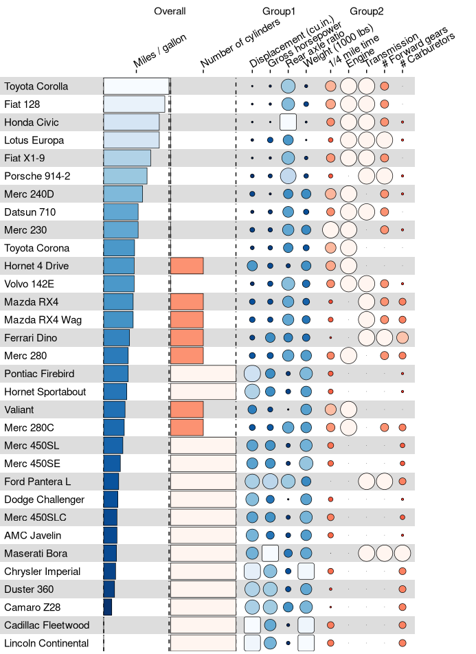

<!-- README.md is generated from README.Rmd. Please edit that file -->

# funkyheatmap: Generating Funky Heatmaps for Data Frames

<!-- badges: start -->

[](https://github.com/dynverse/funkyheatmap/actions/workflows/R-CMD-check.yaml)
<!-- badges: end -->

`funkyheatmap` allows generating heatmap-like visualisations for
benchmark data frames. Funky heatmaps can be fine-tuned by providing
annotations of the columns and rows, which allows assigning multiple
palettes or geometries or grouping rows and columns together in
categories.

## Installation

You can install funkyheatmap like so:

``` r
install.packages("funkyheatmap")
```

You can also download `funkyheatmap` as a [standalone
executable](http://funkyheatmap.dynverse.org/articles/executable.html)
or a [Nextflow
pipeline](http://funkyheatmap.dynverse.org/articles/nextflow.html).

## Example

Let’s use the `mtcars` dataset as an example of what a funky heatmap
looks like.

``` r
library(funkyheatmap)
library(dplyr, warn.conflicts = FALSE)
library(tibble, warn.conflicts = FALSE)

data("mtcars")
```

You can visualise the dataset as follows.

``` r
funky_heatmap(mtcars)
```


## Customising the plot

However, this plot can look so much better if you provide additional
metadata for the rows and columns. See more information on how you can
customise.

``` r
data <- mtcars %>%
  rownames_to_column("id") %>%
  arrange(desc(mpg))

column_info <- tribble(
  ~id,     ~group,         ~name,                      ~geom,        ~palette,    ~options,
  "id",    "",             "",                         "text",       NA,          list(hjust = 0, width = 6),
  "mpg",   "overall",      "Miles / gallon",           "bar",        "palette1",  list(width = 4, legend = FALSE),
  "cyl",   "overall",      "Number of cylinders",      "bar",        "palette2",  list(width = 4, legend = FALSE),
  "disp",  "group1",       "Displacement (cu.in.)",    "funkyrect",  "palette1",  lst(),
  "hp",    "group1",       "Gross horsepower",         "funkyrect",  "palette1",  lst(),
  "drat",  "group1",       "Rear axle ratio",          "funkyrect",  "palette1",  lst(),
  "wt",    "group1",       "Weight (1000 lbs)",        "funkyrect",  "palette1",  lst(),
  "qsec",  "group2",       "1/4 mile time",            "circle",     "palette2",  lst(),
  "vs",    "group2",       "Engine",                   "circle",     "palette2",  lst(),
  "am",    "group2",       "Transmission",             "circle",     "palette2",  lst(),
  "gear",  "group2",       "# Forward gears",          "circle",     "palette2",  lst(),
  "carb",  "group2",       "# Carburetors",            "circle",     "palette2",  lst()
)
```

``` r
funky_heatmap(data, column_info = column_info, expand = list(xmax = 4))
```



## More information

-   The [reference
    documentation](http://funkyheatmap.dynverse.org/reference/index.html)
    on `funky_heatmap()` details the exact formats of each annotation
    object that you can pass to it.

-   Check out the vignette
    [`vignette("mtcars", "funkyheatmap")`](http://funkyheatmap.dynverse.org/articles/mtcars.html)
    for more information on how to customize this visualisation.

-   In
    [`vignette("dynbenchmark", "funkyheatmap")`](http://funkyheatmap.dynverse.org/articles/dynbenchmark.html)
    we use funkyheatmap to regenerate the figures from Saelens et
    al. (2019)
    [doi:10.1038/s41587-019-0071-9](https://doi.org/10.1038/s41587-019-0071-9).

-   We used [Viash](https://viash.io) to wrap the
    `funkyheatmap::funky_heatmap()` function as a [standalone
    executable](http://funkyheatmap.dynverse.org/articles/executable.html)
    and [Nextflow
    module](http://funkyheatmap.dynverse.org/articles/nextflow.html).
