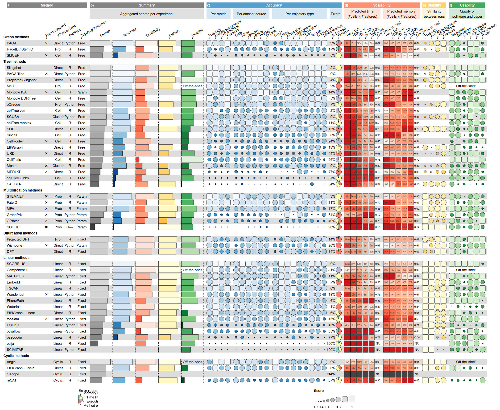

``` r
library(funkyheatmap)

funky_heatmap(
  data = dynbenchmark_data$data,
  column_info = dynbenchmark_data$column_info,
  column_groups = dynbenchmark_data$column_groups,
  row_info = dynbenchmark_data$row_info,
  row_groups = dynbenchmark_data$row_groups,
  palettes = dynbenchmark_data$palettes,
  col_annot_offset = 3.2
)
```

    ## ℹ No legends were provided, trying to automatically infer legends.

    ## ℹ Some palettes were not used in the column info, adding legends for them.

    ## ℹ Legend 1 did not contain a geom, inferring from the column info.

    ## ! Legend 1 has geom 'bar', which is not yet implemented. Disabling for now.

    ## ℹ Legend 2 did not contain a geom, inferring from the column info.

    ## ! Legend 2 has geom 'bar', which is not yet implemented. Disabling for now.

    ## ℹ Legend 3 did not contain a geom, inferring from the column info.

    ## ! Legend 3 has geom 'bar', which is not yet implemented. Disabling for now.

    ## ℹ Legend 4 did not contain a geom, inferring from the column info.

    ## ! Legend 4 has geom 'bar', which is not yet implemented. Disabling for now.

    ## ℹ Legend 5 did not contain a geom, inferring from the column info.

    ## ! Legend 5 has geom 'bar', which is not yet implemented. Disabling for now.

    ## ℹ Legend 6 did not contain a geom, inferring from the column info.

    ## ℹ Legend 6 did not contain labels, inferring from the geom.

    ## ℹ Legend 6 did not contain color, inferring from the palette.

    ## ℹ Legend 7 did not contain a geom, inferring from the column info.

    ## ℹ Legend 7 did not contain labels, inferring from the geom.

    ## ! Legend 7 has geom text but no specified labels, so disabling this legend for now.

<figure>

<figcaption aria-hidden="true">An example of a
<code>{funkyheatmap}</code> visualisation using data from a benchmarking
study of trajectory inference methods <span class="citation"
data-cites="comparisonsinglecell_saelens2019">[@comparisonsinglecell_saelens2019]</span>.</figcaption>
</figure>

| Data type         | Example                          | Recommended geom    |
|:------------------|:---------------------------------|:--------------------|
| Numerical data    | Scores from 0 to 1               | funkyrect           |
| Aggregated data   | The mean of scores               | bar                 |
| Measurement data  | 3MB or 4h                        | rect + text overlay |
| Categorical data  | R or Python                      | text or image       |
| Proportional data | 80% success, 10% OOM, 10% failed | pie                 |
